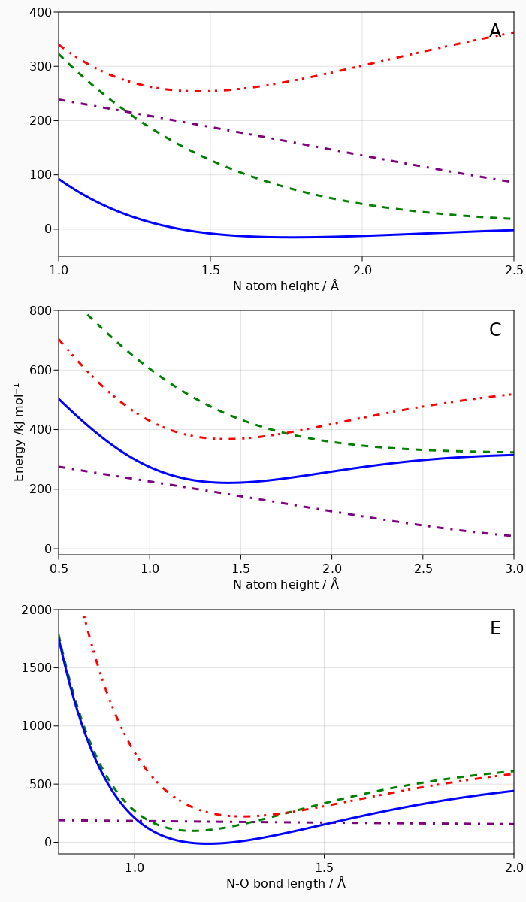

# NOAu111

Here you can find an implementation of the NO on Au(111) model Hamiltonian
presented by Roy, Shenvi and Tully in [J. Chem. Phys. 130, 174716 (2009)](https://doi.org/10.1063/1.3122989).

This implementation uses JuLIP to compute the interatomic potentials which requires
the [MolSim registry](https://github.com/JuliaMolSim/MolSim) to be installed.

## Reproducing figure 2 from J. Chem. Phys. 130, 174716 (2009)

